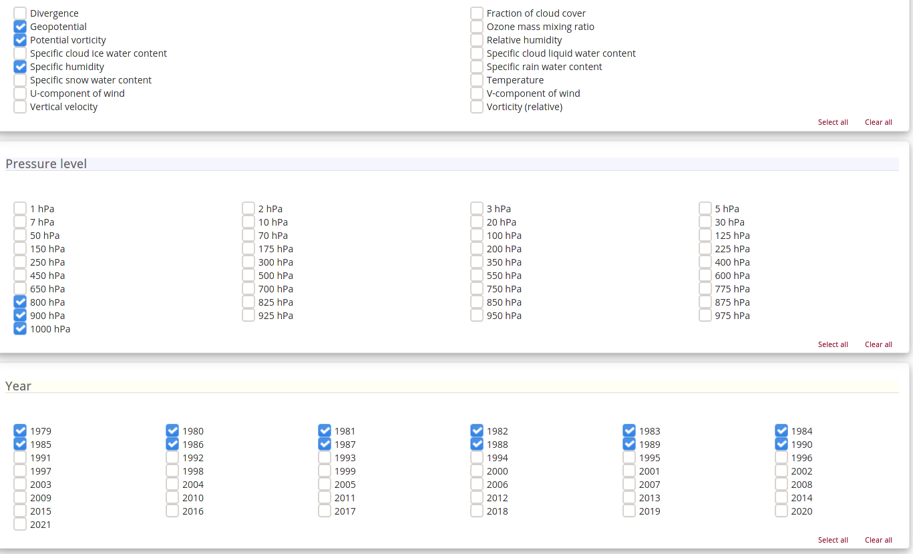
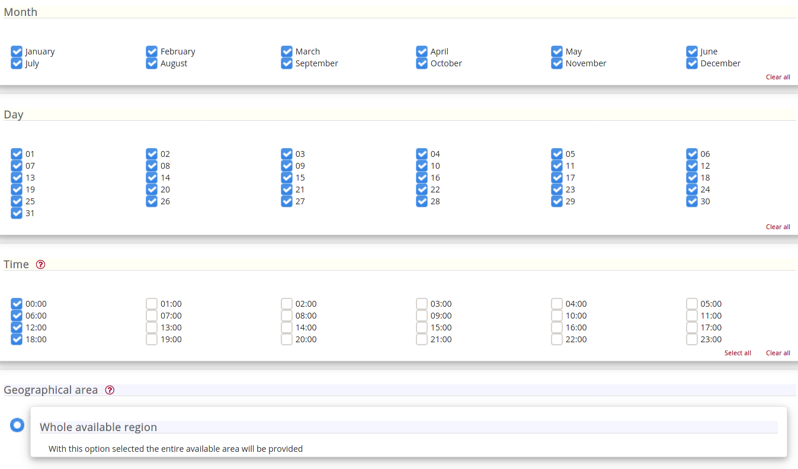
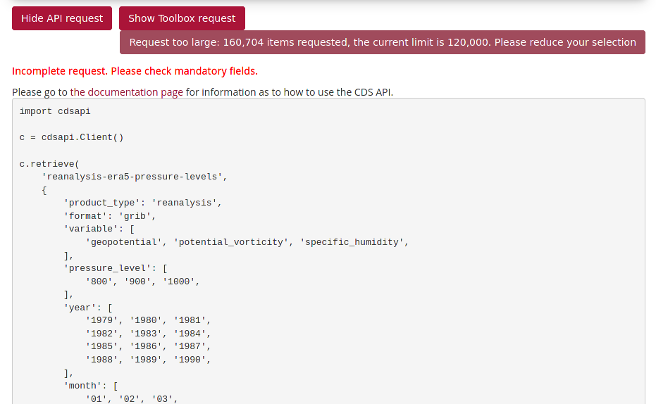

# ERA5-dl: a simple helper for downloading ECMWF's ERA5 reanalysis data


## Dependencies and requirements:

* `cdsapi`: Python package. Can be installed via `pip install cdsapi`.
* ECMWF account and a `.cdsapirc` token file in the *HOME* directory. See
  https://confluence.ecmwf.int/display/CKB/How+to+download+ERA5 for more
  details.

## Install

Install via `pip`:

```
pip install era5dl
```

## Features and usages

### 1. Batch download

Send batch download jobs to retrieve large amount of data while saving
the downloaded data into separate files, e.g. each for a year.

E.g. to download u-wind and geo-potential during 2000-2001, on pressure levels
1000 and 800 hPa, while
skipping some combinations of variables, years and levels:

```
from era5dl import batchDownload, TEMPLATE_DICT

OUTPUTDIR='.'

JOB_DICT = {
    'variable': ['u_component_of_wind', 'geopotential'],
    'year': range(2000, 2002),
    'pressure_level': [1000, 800]
}

SKIP_LIST = [
    {'variable': 'u_component_of_wind', 'year': [2000, ], 'pressure_level': [1000, 800]},
    {'variable': 'geopotential', 'year': [2001, ], 'pressure_level': [800, ]}, ]

batchDownload(TEMPLATE_DICT, JOB_DICT, SKIP_LIST, OUTPUTDIR, dry=True, pause=3)
```

### 2. Keep a log

A log file is created in the same folder where the downloaded data are saved.

Example log:

```
<util_downloader.py-processJob()>: 2021-04-17 20:20:38,289,INFO: <batch_download>: Output folder at: ./
<util_downloader.py-processJob()>: 2021-04-17 20:20:38,290,INFO: Launch job 1
<util_downloader.py-processJob()>: 2021-04-17 20:20:38,290,INFO: Job info: {'product_type': 'reanalysis', 'format': 'netcdf', 'variable': 'u_component_of_wind', 'pressure_level': 800, 'year': 2001, 'month': ['01', '02', '03', '04', '05', '06', '07', '08', '09', '10', '11', '12'], 'day': ['01', '02', '03', '04', '05', '06', '07', '08', '09', '10', '11', '12', '13', '14', '15', '16', '17', '18', '19', '20', '21', '22', '23', '24', '25', '26', '27', '28', '29', '30', '31'], 'time': ['00:00', '06:00', '12:00', '18:00'], 'area': [10, 80, -10, 100]}
<util_downloader.py-processJob()>: 2021-04-17 20:20:38,290,INFO: Output file location: ./[ID0]800-u_component_of_wind-2001.nc
<util_downloader.py-processJob()>: 2021-04-17 20:20:41,293,INFO: <batch_download>: Output folder at: ./
<util_downloader.py-processJob()>: 2021-04-17 20:20:41,294,INFO: Launch job 2
<util_downloader.py-processJob()>: 2021-04-17 20:20:41,294,INFO: Job info: {'product_type': 'reanalysis', 'format': 'netcdf', 'variable': 'u_component_of_wind', 'pressure_level': 1000, 'year': 2001, 'month': ['01', '02', '03', '04', '05', '06', '07', '08', '09', '10', '11', '12'], 'day': ['01', '02', '03', '04', '05', '06', '07', '08', '09', '10', '11', '12', '13', '14', '15', '16', '17', '18', '19', '20', '21', '22', '23', '24', '25', '26', '27', '28', '29', '30', '31'], 'time': ['00:00', '06:00', '12:00', '18:00'], 'area': [10, 80, -10, 100]}
<util_downloader.py-processJob()>: 2021-04-17 20:20:41,294,INFO: Output file location: ./[ID1]1000-u_component_of_wind-2001.nc
<util_downloader.py-processJob()>: 2021-04-17 20:20:44,296,INFO: <batch_download>: Output folder at: ./
<util_downloader.py-processJob()>: 2021-04-17 20:20:44,296,INFO: Launch job 3
...
```

### 3. Skip already downloaded files

When running a batch downloading job, each finished job is recorded in a text file
named `downloaded_list.txt` in the same folder as the saved data.
If the downloading is interrupted, for instance by network issues, a second run
of the script will first look at the `downloaded_list.txt` file
and exclude those already finished retrievals.


### 4. Create a batch download job by splitting the api request from ECMWF web

E.g.

One selects the desired data from the CDS web interface as shown in the following
3 screen captures:







Notice that it is warned that the requested field is too large. Even if
not, one may want to split the entire data into smaller, more manageable chunks,
for instance, by saving each variable in each year, on each vertical level
into a separate file.

To split the retrieval, first click the **Show API request** button at the bottom
of the page, and copy and save the Python code into a text file, e.g. `api.txt`,
then run a Python script with the following content:

```
from era5dl import batchDownloadFromWebRequest

OUTPUTDIR='./'
DRY=False

batchDownloadFromWebRequest('./api.txt', OUTPUTDIR,
    ['variable', 'pressure_level', 'year'], DRY, pause=3)
```

The `['variable', 'pressure_level', 'year']` list tells that the batch job
is split by these 3 dimensions/fields, such that each sub-job consists of
each variable in each year, on each vertical level, and the data of the sub-job
is saved into a separate file.

Again, already downloaded data are recorded in the `downloaded_list.txt` file
and re-executing the script will not re-download them.

### 5. Automatically generate meaningful file names

The `batchDownload()` and `batchDownloadFromWebRequest()` functions accept
a `naming_func` keyword argument, which can be `None`, or a callable.

If a callable, it should be a function that accepts
a single input argument which is a dict defining
the data retrieval task, and returns a string as the filename
(without folder path) to name the downloaded data.

If `None`, it will construct a default filename, using the following format:

`[ID<n>]<attributes>.nc` or `[ID<n>]<attributes>.grb`.

where `<n>` is the numerical id of the job, `<attributes>` is a
dash concatenated string joining the attributes that define the job.
E.g.

```
[ID02]700-geopotential-2000.nc
```

### 6. Dry run

The `batchDownload()` and `batchDownloadFromWebRequest()` functions accept
a `dry` positional argument. When set to `True`, will simulate the retrieval
rather than actually sending the `cdsapi` retrieval request. This can be used
to test the request definition.


## Contribution

This tool is still in early development stage.  Contributions and bug reports
are welcome. Please create a fork of the project on GitHub and use a pull
request to propose your changes.
